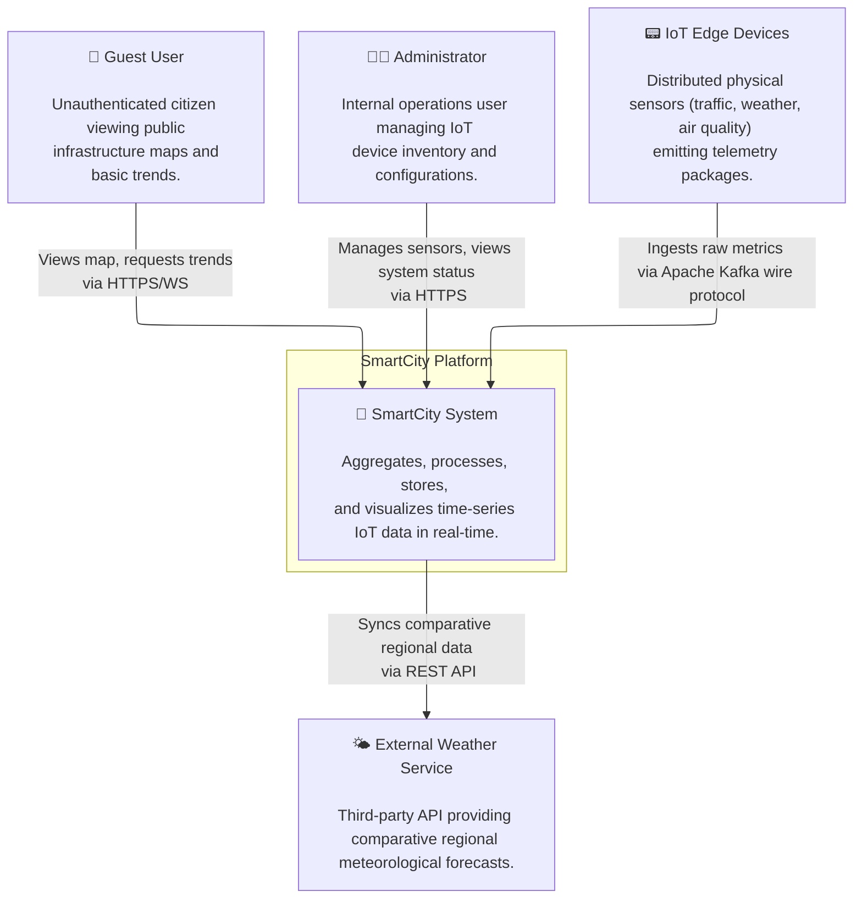

# 🏙️ C4 Architecture: Level 1 - System Context

The System Context diagram provides a high-level overview of the SmartCity platform, showing how users and external systems interact with it.

```mermaid
---
config:
  layout: elk
---
flowchart TB
    %% --- Element Definitions ---
    
    %% Users
    GuestUser["👥 Guest User<br/><br/>Unauthenticated citizen viewing public<br/> infrastructure maps and basic trends."]
    AdminUser["👨‍💻 Administrator<br/><br/>Internal operations user managing IoT <br/>device inventory and configurations."]

    %% Main System (Boundary)
    subgraph SmartCitySystemBoundary ["SmartCity Platform"]
        SmartCitySystem["🏢 SmartCity System<br/><br/>Aggregates, processes, stores, <br/>and visualizes time-series IoT data in real-time."]
    end

    %% External Systems
    IoTDevices["📟 IoT Edge Devices<br/><br/>Distributed physical sensors (traffic, weather, air quality) <br/>emitting telemetry packages."]
    WeatherAPI["🌤️ External Weather Service<br/><br/>Third-party API providing comparative regional meteorological forecasts."]

    %% --- Relationship Links ---
    
    GuestUser -->|Views map, requests trends<br/> via HTTPS/WS| SmartCitySystem
    AdminUser -->|Manages sensors, views system status<br/> via HTTPS| SmartCitySystem
    IoTDevices -->|Ingests raw metrics <br/>via Apache Kafka wire protocol| SmartCitySystem
    SmartCitySystem -->|Syncs comparative regional data<br/> via REST API| WeatherAPI
    
```
