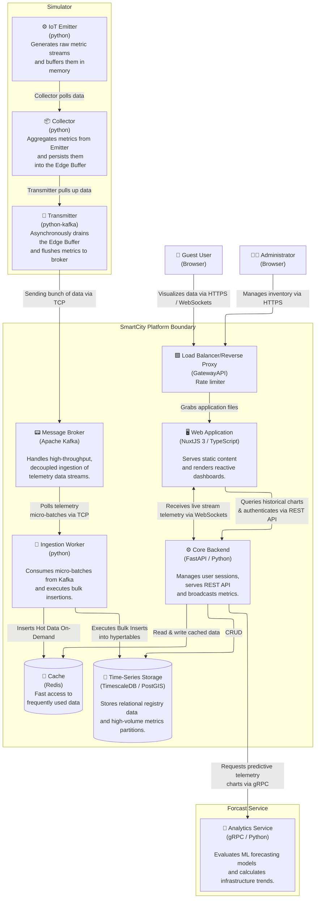

# 📦 C4 Architecture: Level 2 - Containers

The Container diagram shows the high-level shape of the software architecture and how responsibilities are distributed across runtime instances.

```mermaid
---
config:
  layout: elk
---
flowchart TB
    %% --- Users ---
    Guest["👥 Guest User\n(Browser)"]
    Admin["👨‍💻 Administrator\n(Browser)"]

    %% --- Container Boundary ---
    subgraph Platform["SmartCity Platform Boundary"]
        %% Load balancer
        GatewayAPI["🟩 Load Balancer/Reverse Proxy\n(GatewayAPI)\n Rate limiter"]
        %% Frontend
        WebUI["🖥️ Web Application\n(NuxtJS 3 / TypeScript)\n\nServes static content\nand renders reactive dashboards."]
        
        %% Ingestion & Brokers
        Kafka["📟 Message Broker\n(Apache Kafka)\n\nHandles high-throughput,\ndecoupled ingestion of\ntelemetry data streams."]
        
        %% Cache
        Redis[("🚀 Cache\n(Redis)\nFast access to\nfrequently used data")]
        
        %% Core Backend
        Core["⚙️ Core Backend\n(FastAPI / Python)\n\nManages user sessions,\nserves REST API \nand broadcasts metrics."]
        
        %% Time-series Worker
        Ingestor["🔄 Ingestion Worker\n(python)\n\nConsumes micro-batches from Kafka\nand executes bulk insertions."]
       
        %% Database Cluster
        Timescale[("💾 Time-Series Storage\n(TimescaleDB / PostGIS)\n\nStores relational registry data \nand high-volume metrics partitions.")]
    end
     %% Analytics Module
    subgraph Forcast Service
    Analytics["🧠 Analytics Service\n(gRPC / Python)\n\nEvaluates ML forecasting models \nand calculates infrastructure trends."]
    end

    %% --- External Sources ---
    subgraph Simulator
    Emitter["⚙️ IoT Emitter\n(python)\nGenerates raw metric streams\n and buffers them in memory"]
    Collector["📦 Collector\n(python)\nAggregates metrics from Emitter\n and persists them\n into the Edge Buffer"]
    Transmitter["📡 Transmitter\n(python-kafka)\nAsynchronously drains\n the Edge Buffer \nand flushes metrics to broker"]
    end
    %% --- Connections ---
    
    Guest -->|Visualizes data via HTTPS / WebSockets| GatewayAPI
    Admin -->|Manages inventory via HTTPS| GatewayAPI
    GatewayAPI -->|Grabs application files| WebUI

    WebUI -->|Queries historical charts\n& authenticates via REST API| Core
    WebUI <-->|Receives live stream telemetry via WebSockets| Core
    
    Emitter -->|"Collector polls data"| Collector
    Collector -->|"Transmitter pulls up data"| Transmitter
    Transmitter -->|Sending bunch of data via TCP| Kafka
    Kafka -->|Polls telemetry \nmicro-batches via TCP| Ingestor

    Ingestor -->|Executes Bulk Inserts\ninto hypertables| Timescale
    Ingestor -->|Inserts Hot Data On-Demand| Redis
    Core -->|CRUD| Timescale
    Core -->|"Read & write cached data"| Redis

    Core -->|Requests predictive telemetry\ncharts via gRPC| Analytics
```
