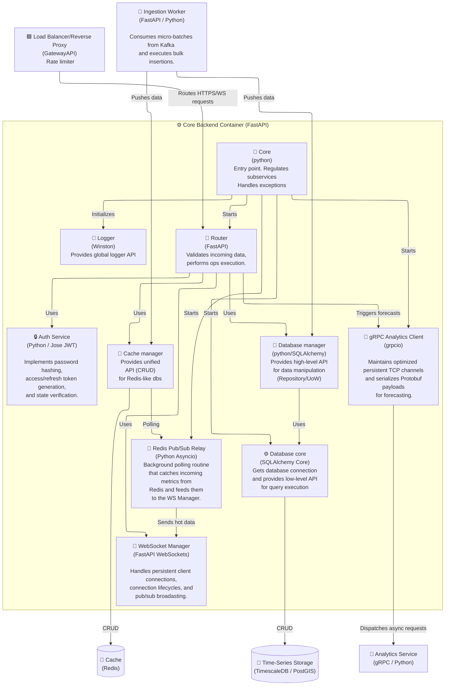
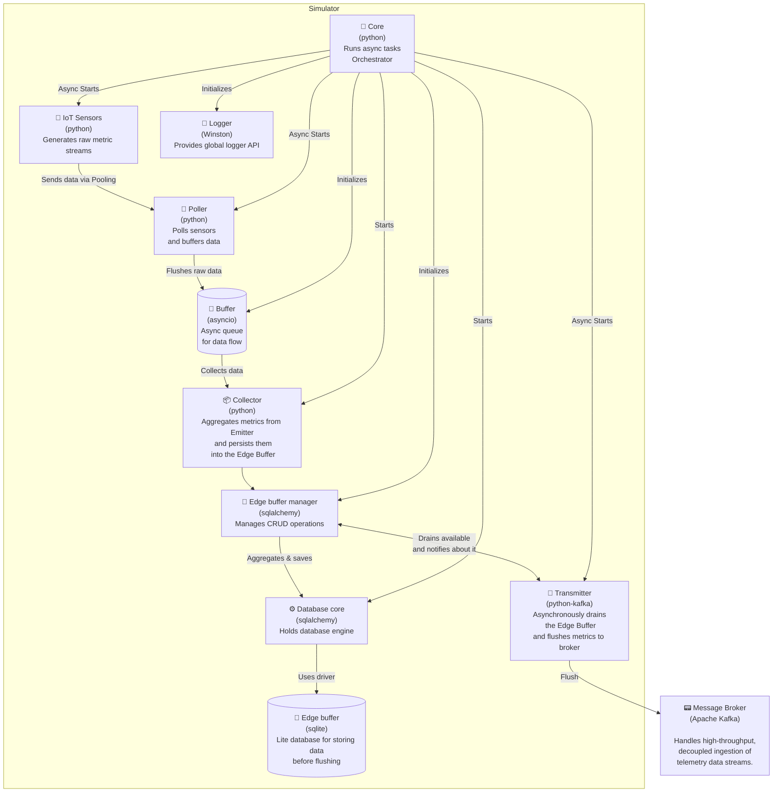

# 🧩 C4 Architecture: Level 3 - Component Diagram (Core Backend, Simulator)

This diagram details the internal software modules, controllers, and services inside the **Core Backend (Python)** container and maps their interfaces to adjacent system containers.

Next diagram describes the internal software modules and services inside the **Simulator** context and maps their interfaces to adjacent system containers.

