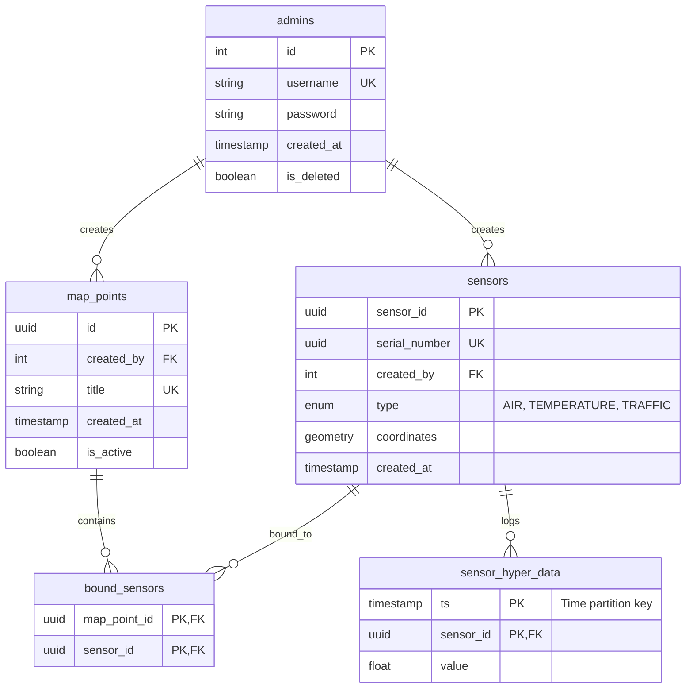
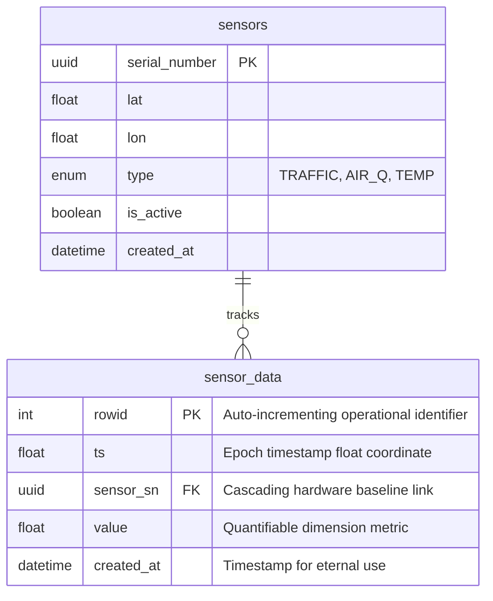

# 📊 Data Models (Timescale and Edge)

---

## 💾 TimescaleDB Schema & ER Diagram

This document defines the actual relational and time-series database structure generated.



## 1. Relational Inventory Layer (PostgreSQL Standard)

### `admins`

* Internal operations identity registry for platform configuration and asset management.

### `map_points`

* Logical coordinates grouping representing visible regional map pins or municipal tracking anchors.

### `sensors`

* Physical edge hardware specifications tracking locations via GIST(Point).

### `bound_sensors`

* Many-to-Many join table mapping physical `sensors` to logical cluster markers (`map_points`).

## 2. Time-Series Hypertable Layer (TimescaleDB)

### `sensor_hyper_data`

* High-throughput metrics table tracking incoming IoT events.
* Transformed into a TimescaleDB hypertable partitioned by the `ts` timestamp coordinate.

```sql
-- Executed via Alembic operation block
SELECT create_hypertable('sensor_hyper_data', 'ts', if_not_exists => TRUE);
```

## 3. Storage Optimization & Guardrails

To prevent disk saturation from raw data influx, the following automatic storage policies are attached to the `sensor_hyper_data` hypertable:

### A. Data Compression Policy

* Converts old chunks from standard row-oriented architecture to optimized columnar format after **7 days** to save up to 90% space.

```sql
ALTER TABLE sensor_hyper_data SET (
    timescaledb.compress,
    timescaledb.compress_segmentby = 'sensor_id',
    timescaledb.compress_orderby = 'ts DESC'
);

SELECT add_compression_policy('sensor_hyper_data', INTERVAL '7 days');
```

### B. Data Retention Policy

* Automatically drops historical telemetry chunks older than **90 days** to enforce hard resource boundaries.

```sql
SELECT add_retention_policy('sensor_hyper_data', INTERVAL '90 days');
```

---

## 💾 Edge Buffer Database (SQLite)

This document specifies the internal physical storage architecture running locally inside the **IoT Simulator (Edge Unit)** to provide local persistence and network fault tolerance via SQLite.



## 1. Database Table Specifications

### `sensors (IoT)`

* Acts as a local hardware registry snapshot for the simulator runtime.
* **Compound Index Optimization:** A unique compound index `idx_sensors_lat_lon` is mapped over `['lat', 'lon', 'type']`. This prevents the instantiation of twin virtual hardware targets producing redundant telemetry vectors on identical spatial coordinate matrix blocks.

### `sensor_data`

* The primary operational edge logging array acting as the physical **Edge Buffer**.
* **Compound Index Optimization:** The unique index `idx_sensordata_sensor_ts` mapped over `['sensor_sn', 'ts']` blocks time-series collision events if an identical hardware target registers duplicate clock ticks.
* **Foreign Key Constraint:** Bound via a cascading delete link (`ondelete='CASCADE'`). Purging a legacy tracking node from the simulation automatically wipes its buffered logging history tail.
