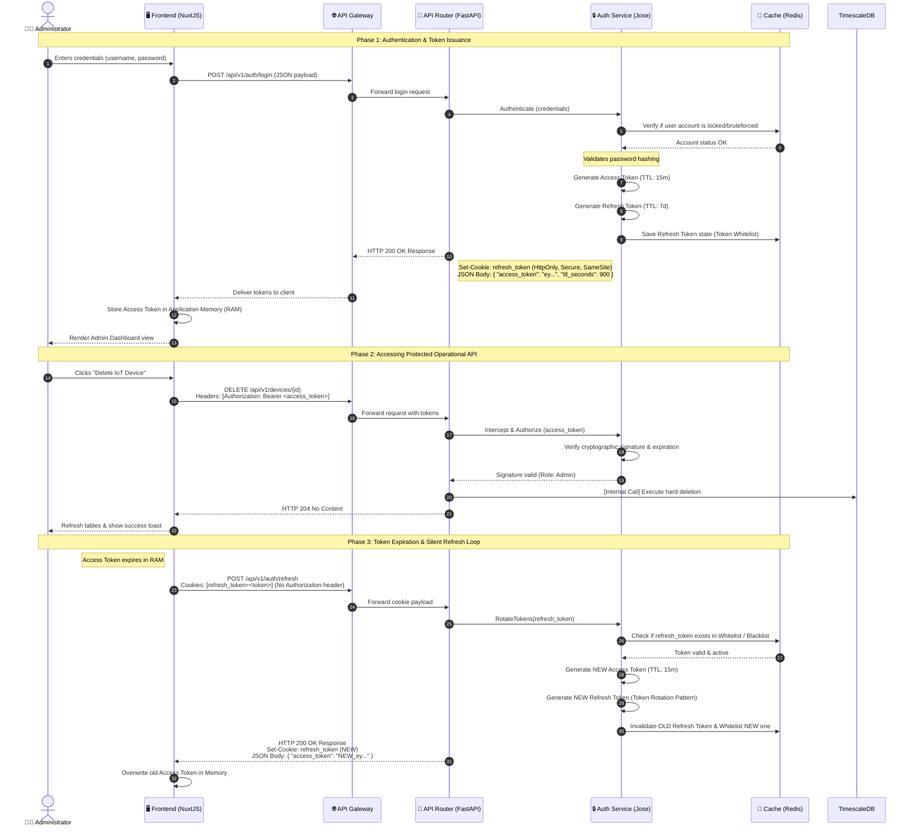

# 🔄 Sequence Diagram: Admin Authentication & JWT Rotation

This workflow details the secure authentication architecture, token storage guardrails, and silent refresh rotation loops for the Administrator role.

