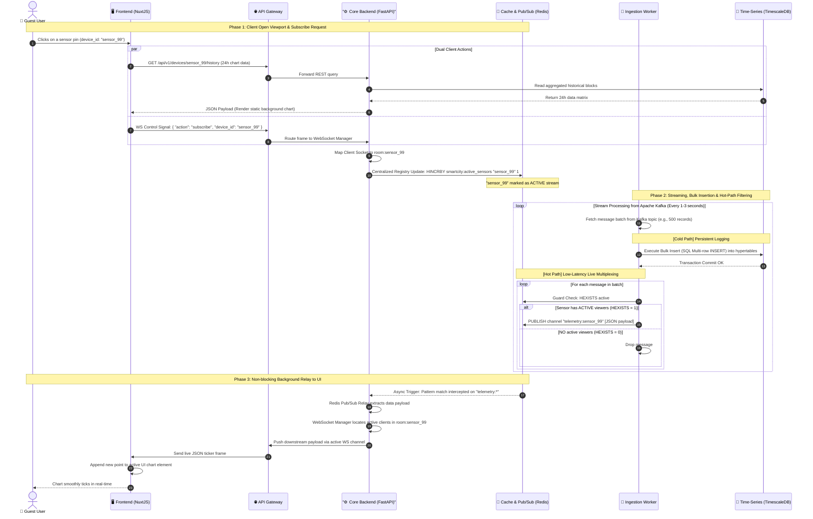

# 🔄 Sequence Diagram: On-Demand Ingestion & Live Telemetry Stream

This workflow specifies the dual-path data pipeline (Cold/Hot Path separation) enforcing high-throughput ingestion (10,000 rps) alongside dynamic client web socket subscriptions.

