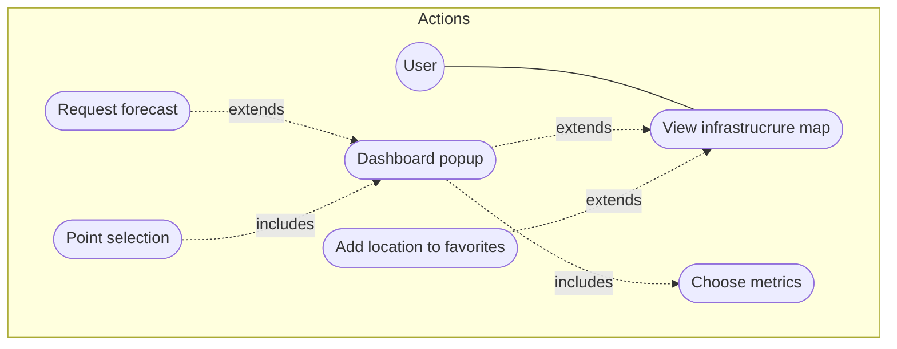
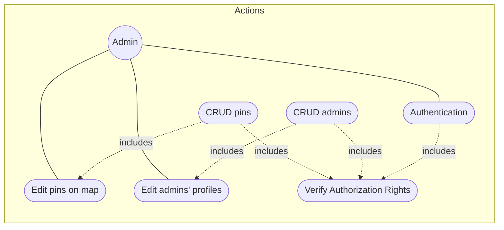

# 👥 Use Case Specifications: User & Admin Roles

```mermaid
graph TB
    User((User))
    
    subgraph Actions
    %% User actions
    U_VIM([View infrastrucrure map])

    %% User extend/include
    UE_DASHBOARD([Dashboard popup])
    UI_CHOOSEMETRICS([Choose metrics])
    UI_SELECTPOINT([Point selection])
    UE_ASKFORECAST([Request forecast])
    UE_ADDLOCTOFAV([Add location to favorites])
    %% ------
    User --- U_VIM

    UE_DASHBOARD -.->|extends| U_VIM
    UE_ADDLOCTOFAV -.->|extends| U_VIM
    UE_ASKFORECAST -.->|extends| UE_DASHBOARD
    UE_DASHBOARD -.->|includes| UI_CHOOSEMETRICS
    UI_SELECTPOINT -.->|includes| UE_DASHBOARD
    end
    
```

```mermaid
flowchart LR
    Admin((Admin))
    
    subgraph Actions
    %% Admin actions

    A_AUTH([Authentication])
    A_EDITPINS([Edit pins on map])
    A_EDITUSERS([Edit admins' profiles])

    %% Admin extend/include
    AI_CRUDPINS([CRUD pins])
    AI_CRUDUSERS([CRUD admins])
    A_CHECK_PERM([️Verify Authorization Rights])
    %% ------
    Admin --- A_AUTH
    Admin --- A_EDITPINS
    Admin --- A_EDITUSERS

    AI_CRUDPINS -.->|includes| A_EDITPINS
    AI_CRUDUSERS -.->|includes| A_EDITUSERS

    AI_CRUDPINS -.->|includes| A_CHECK_PERM
    AI_CRUDUSERS -.->|includes| A_CHECK_PERM
    A_AUTH -.->|includes| A_CHECK_PERM
    end
```
